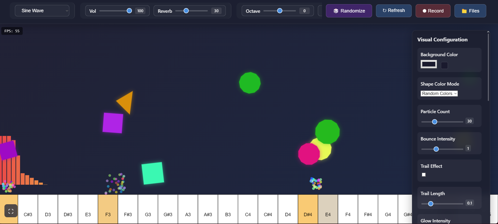

# Musical Bouncing Shapes

A creative web-based music generator that creates melodies through bouncing shapes and physics interactions. The project combines visual elements with sound synthesis to create an interactive audio-visual experience.

## Overview

This project features bouncing geometric shapes that generate musical notes when they collide with the ground. The position of each collision determines the pitch of the note, creating emergent melodies through physics-based interactions.

*Reference image showing the interactive music generator interface*

## Features

### Audio Synthesis
- Multiple synthesizer types:
  - **Basic Waveforms**: Sine, Square, Triangle, Sawtooth
  - **Bass Sounds**: TB-303, Acid Bass, Sub Bass, Wobble Bass
  - **Lead Instruments**: Super Saw, Pluck Synth, FM Synth, PWM Synth
  - **Classic Instruments**: Piano, Organ, Bells, Pad Synth
- Real-time audio parameter controls:
  - Volume and Reverb mixing
  - Filter cutoff and resonance
  - ADSR envelope controls
  - LFO rate and depth
  - Octave shifting and detune
  - Individual parameter randomization

### Recording System
- **Dual Format Recording**:
  - MIDI recording for musical notation
  - High-quality WAV audio recording
  - Simultaneous MIDI and WAV capture
- **Advanced File Management**:
  - Organized file groups by recording session
  - Automatic file naming with timestamps
  - Built-in audio player with progress bar
  - Play/Pause controls with seek functionality
  - One-click file downloads
  - Batch file management
  - Relative timestamp display

### Visual Elements
- Three interactive shape types:
  - Circles with smooth edges
  - Squares with rotation
  - Triangles with physics
- Dynamic shape behavior:
  - Automatic shape creation/destruction
  - Minimum and maximum shape limits
  - Physics-based interactions
  - Collision detection
- Visual effects:
  - Customizable trail effects
  - Adjustable glow intensity
  - Multiple color modes (Random, Gradient, Monochrome, Rainbow)
  - Particle interactions
  - Explosion effects on collision
  - Shape replication and disappearance chances

### Interface
- Modern, responsive design
- Collapsible control panels
- Real-time parameter adjustment
- Visual feedback for all controls
- Fullscreen mode support
- FPS counter and optimization
- Tooltips for all controls
- Settings import/export functionality

### Physics Parameters
- Adjustable bounce intensity
- Rotation speed control
- Particle size and count
- Gravitational effects
- Collision response
- Shape morphing
- Interactive boundaries

## How to Use

### Basic Controls
1. **Start/Stop**: Click the Refresh button to reset the scene
2. **Adjust Parameters**: Use the control panel to modify sound and visual settings
3. **Record**: Click the Record button to start capturing both MIDI and audio
4. **Manage Files**: Access recordings through the Files panel
5. **Randomize**: Click the Randomize button to generate new parameter combinations

### Recording Process
1. Click the "Record" button to start recording
2. Let shapes bounce to create your melody
3. Click "Stop" to end recording
4. Both MIDI and WAV files are automatically saved
5. Access recordings in the File Manager:
   - Files are grouped by recording session
   - MIDI files can be imported into DAWs
   - WAV files can be played directly
   - Download or delete files as needed

### File Manager Features
- **Organized Layout**: Files are grouped by recording session
- **Playback Controls**: 
  - Play/Pause toggle
  - Seek bar for navigation
  - Time display
  - Volume control
- **File Operations**:
  - Download files
  - Delete recordings
  - Preview audio
  - Group management

### Settings Management
- Export current configuration
- Import saved settings
- Quick parameter randomization
- Preset management

## Technical Details

### Audio System
- Web Audio API for synthesis
- Real-time audio processing
- High-quality audio recording
- MIDI file generation
- Multiple synthesis algorithms

### Visual Engine
- HTML5 Canvas rendering
- Optimized animation loop
- Efficient particle system
- Dynamic shape management
- FPS-based performance optimization

### File Handling
- Blob-based file management
- WAV file conversion
- MIDI file generation
- Automatic cleanup
- Resource management

## Browser Compatibility

For the best experience, use a modern browser with Web Audio API support:
- Chrome (recommended)
- Firefox
- Edge
- Safari (limited audio recording support)

## Future Development

Planned enhancements:
- Polyphonic synthesis
- Multiple simultaneous instruments
- Rhythm pattern generation
- Harmony system
- Advanced physics interactions
- Additional visual effects
- MIDI import capability
- More instrument presets
- Advanced audio effects
- Collaborative features

## Technical Requirements

- Modern web browser with Web Audio API support
- JavaScript enabled
- Recommended minimum resolution: 1024x768
- Audio output device
- Optional: MIDI-compatible software for MIDI file playback 